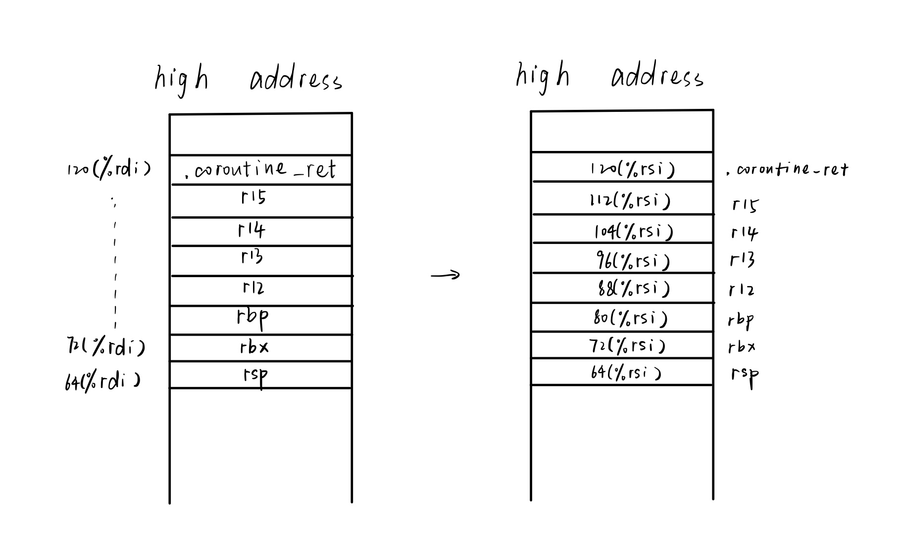
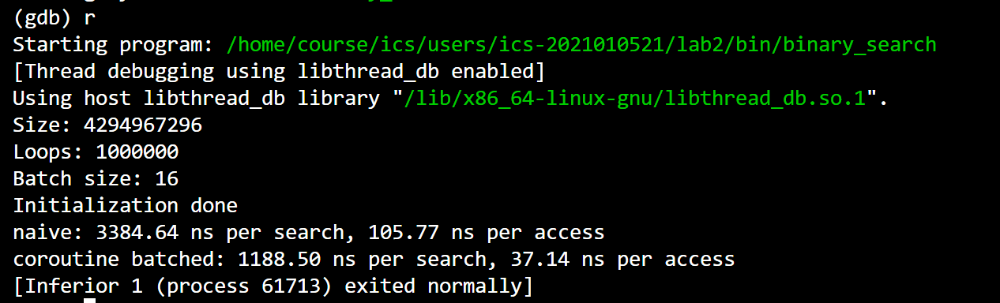
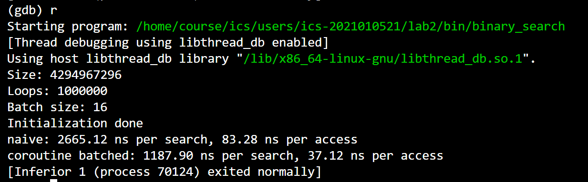
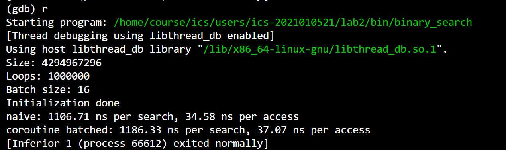
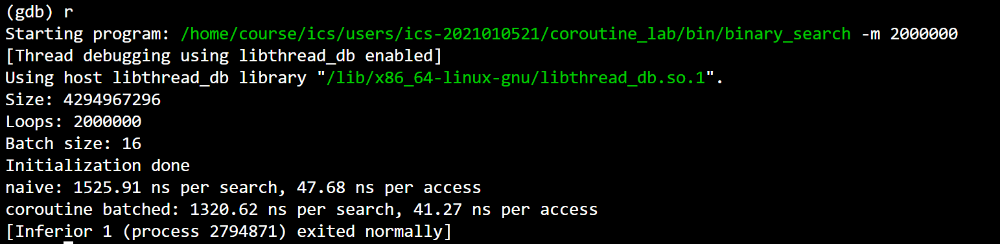
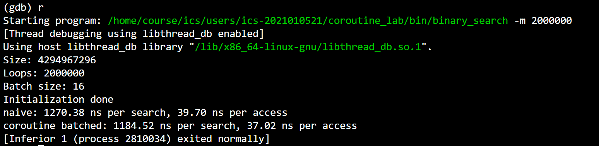
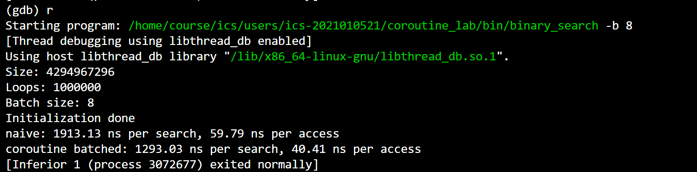
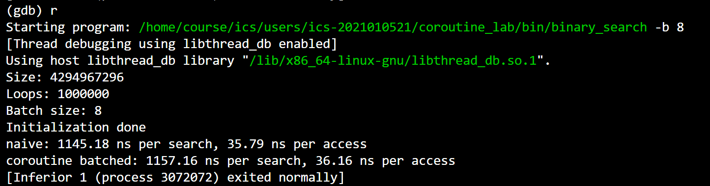

# Report
刘雅迪 计26  
学号：2021010521
## Task 1: 协程库的编写
### coroutine_switch的汇编代码
主要需要实现coroutine_switch的汇编代码，因为协程中断函数yield和协程运行函数resume都是通过这个函数实现的。
coroutine_switch的汇编代码如下：
```
.global coroutine_switch
coroutine_switch:
    # TODO: Task 1
    # 保存 callee-saved 寄存器到 %rdi 指向的上下文
    movq %rsp, 64(%rdi)
    movq %rbx, 72(%rdi)
    movq %rbp, 80(%rdi)
    movq %r12, 88(%rdi)
    movq %r13, 96(%rdi)
    movq %r14, 104(%rdi)
    movq %r15, 112(%rdi)
    # 保存的上下文中 rip 指向 ret 指令的地址（.coroutine_ret）
    leaq .coroutine_ret(%rip), %rax
    movq %rax, 120(%rdi)

    # 从 %rsi 指向的上下文恢复 callee-saved 寄存器
    movq 64(%rsi), %rsp
    movq 72(%rsi), %rbx
    movq 80(%rsi), %rbp
    movq 88(%rsi), %r12 
    movq 96(%rsi), %r13
    movq 104(%rsi), %r14
    movq 112(%rsi), %r15
    # 最后 jmpq 到上下文保存的 rip
    jmpq *120(%rsi)

.coroutine_ret:
    ret
```
这段汇编代码按照框架上给的注释写即可，需要注意的是“保存的上下文中rip指向ret指令的地址”不能使用movq指令，而要使用leaq指令，因为moveq传的是值而leaq传的才是地址，使用moveq会出现不匹配的报错（因为这一点debug了好久）
### yield函数
```
void yield() {
  if (!g_pool->is_parallel) {
    // 从 g_pool 中获取当前协程状态
    auto context = g_pool->coroutines[g_pool->context_id];
    
    // 调用 coroutine_switch 切换到 coroutine_pool 上下文
    coroutine_switch(context->callee_registers, context->caller_registers);
  }
}
```
yield直接调用上文中提到的coroutine_switch函数，保存当前协程状态的callee_registers，恢复其caller_registers的调用来实现当前协程的中断与另一协程的调用。
### resume函数
```
virtual void resume() {
    // 调用 coroutine_switch
    // 在汇编中保存 callee-saved 寄存器，设置协程函数栈帧，然后将 rip 恢复到协程 yield 之后所需要执行的指令地址。
    coroutine_switch(caller_registers, callee_registers);
  }
```
resume函数是协程运行函数，它也是通过调用coroutine_switch函数实现协程运行功能。
### serial_execute_all函数
```
void serial_execute_all() {
    is_parallel = false;
    g_pool = this;

    while(1){
      bool done = true;
      int id = 0;
      for(auto context : coroutines){
        if(!context->finished){
          context_id = id;
          done = false;
          context->resume();
          id++;
        }
      }
      if(done) break;
    }
 
    for (auto context : coroutines) {
      delete context;
    }
    coroutines.clear();
  }
```
在Task 1中不需要考虑协程的ready属性，采用轮询的方式挑选一个未完成执行的协程函数进行继续执行的操作。所以此处用了一个while的死循环，如果当前协程状态没有完成，就调用resume函数运行协程。当所有的协程函数都执行后就跳出循环，结束程序。
### 额外要求
1. 绘制出在协程切换时，栈的变化过程；  
协程切换时，栈的变化涉及到保存当前协程状态和恢复下一个协程状态，而coroutine_switch函数负责进行这些切换操作。具体变化过程如下：

2. 并结合源代码，解释协程是如何开始执行的，包括 `coroutine_entry` 和 `coroutine_main` 函数以及初始的协程状态；  
```
uint64_t rsp = (uint64_t)&stack[stack_size - 1];
rsp = rsp - (rsp & 0xF);

void coroutine_main(struct basic_context * context);

callee_registers[(int)Registers::RSP] = rsp;
// 协程入口是 coroutine_entry
callee_registers[(int)Registers::RIP] = (uint64_t)coroutine_entry;
// 设置 r12 寄存器为 coroutine_main 的地址
callee_registers[(int)Registers::R12] = (uint64_t)coroutine_main;
// 设置 r13 寄存器，用于 coroutine_main 的参数
callee_registers[(int)Registers::R13] = (uint64_t)this;
```
初始时程序为协程分配了一个栈并将其对齐到16字节，rsp为栈顶指针，协程的入口rip设置为coroutine_entry，r12为coroutine_main的地址，r13为当前basic_context的实例(this)。finished == false，表示协程尚未完成；ready == false，方便后续在serial_execute_all函数中的调用；ready_func()为空，因为还没有提供自定义的检查函数。
```
void coroutine_main(struct basic_context *context) {
  context->run();
  context->finished = true;
  coroutine_switch(context->callee_registers, context->caller_registers);

  // unreachable
  assert(false);
}
```
当协程开始运行时执行函数coroutine_main，调用重写的run函数并将协程标记为已完成，然后调用coroutine_switch函数切换回调用者的上下文。  
综上所述，协程通过初始化上下文、设置寄存器以及调用coroutine_entry函数来启动协程。当协程启动后，它将执行coroutine_main函数，同时调用重写的run，表明协程正式开始。  
3. 目前的协程切换代码只考虑了通用寄存器，设计一下，如果要考虑浮点和向量寄存器，要怎么处理。  
和使用通用寄存器类似，考虑浮点和向量寄存器也需要保存和恢复寄存器状态，但是可能保存方式有所区别，比如向量寄存器能够储存多组数据，而不是像通用寄存器一样只能储存一组数据。

## Task 2: 实现 sleep 函数
### sleep函数
```
void sleep(uint64_t ms) {
  if (g_pool->is_parallel) {
    auto cur = get_time();
    while (
        std::chrono::duration_cast<std::chrono::milliseconds>(get_time() - cur)
            .count() < ms)
      ;
  } else {
    // 从 g_pool 中获取当前协程状态
    auto context = g_pool->coroutines[g_pool->context_id];
    // 获取当前时间，更新 ready_func
    // ready_func：检查当前时间，如果已经超时，则返回 true
    context->ready = false;
    auto cur_time = get_time();
    context->ready_func = [cur_time, ms](){
      return std::chrono::duration_cast<std::chrono::milliseconds>(get_time() - cur_time)
            .count() >= ms;
    };
    // 调用 coroutine_switch 切换到 coroutine_pool 上下文
    coroutine_switch(context->callee_registers, context->caller_registers);
  }
}
```
sleep函数仿照if部分的写法，结合else中的注释完成即可。标记当前协程的ready==false，同时通过ready_func函数检查是否超过了应该执行的时间，也就是与if中的`.count()<ms`不同，这里应该写`.count()>=ms`，然后调用coroutine_switch函数切换到协程池的上下文。
### serial_execute_all函数的修改
```
void serial_execute_all() {
    is_parallel = false;
    g_pool = this;

    while(1){
      bool done = true;
      int id = 0;
      for(auto context : coroutines){
        if(!context->finished){
          context_id = id;
          done = false;
          //context->resume();
          if(context->ready) context->resume();
          else if(context->ready_func()){ //已经超时了
            context->ready = true;
            context->resume();
          }
        id++;
        }
      }
      if(done) break;
    }
 
    for (auto context : coroutines) {
      delete context;
    }
    coroutines.clear();
  }
```
Task 2需要在serial_execute_all函数中实现对ready的判断，所以修改Task 1写的`context->resume();`语句，换成if-else语句。标记当前协程 `ready = false`，如果 `ready == true`，说明可以继续执行；如果 `ready == false`，则调用 `ready_func`判断是否超过执行的时间，如果返回 `true`，说明可以继续执行了，就设置 `ready = true` 并切换到协程。
### 额外要求
1. 按照时间线，绘制出 `sleep_sort` 中不同协程的运行情况；  
sleep_sort使用多个协程来排序一组数字，每个数字都会启动一个协程。随着时间的推移，每个协程在相应的时间点输出数字，最终实现了对数字的排序。以给的样例为例子，sleep_sort中不同协程的运行情况图大致如下：  
输入1 3 4 5 2
```
时间线：
1.协程A：|--1--|
2.协程B:   |-------3--------|
3.协程C：    |---------4----------|
4.协程D：      |-----------5------------|
5.协程E：        |----2-----|
```
2. 目前的协程库实现方式是轮询 `ready_func` 是否等于 `true`，设计一下，能否有更加高效的方法。  
可以设置一个定时器，当协程超过执行的时间后触发调度，这样可以减少不必要的轮询时间开销。

## Task 3: 利用协程优化二分查找
### lookup_coroutine函数
```
void lookup_coroutine(const uint32_t *table, size_t size, uint32_t value,
                      uint32_t *result) {
  size_t low = 0;
  while ((size / 2) > 0) {
    size_t half = size / 2;
    size_t probe = low + half;

    // TODO: Task 3
    // 使用 __builtin_prefetch 预取容易产生缓存缺失的内存
    // 并调用 yield
    __builtin_prefetch(&table[probe]);
    yield();
    
    uint32_t v = table[probe];
    if (v <= value) {
      low = probe;
    }
    size -= half;
  }
  *result = low;
}
```
按照注释提示写，使用__builtin_prefetch后调用yield函数。
### 额外要求
1. 汇报性能的提升效果。
笔者尝试了通过命令行参数设置不同的参数，来观察性能，在此只记录性能得到提升的结果：  
* 使用协程优化二分查找后在同一参数下查找所用的时间较为固定，没有naive二分查找那么不稳定。如当使用初始参数时，优化后的二分查找时间稳定在1186ns per search左右，而naive二分查找好的情况下可以达到1106ns per search左右，差的情况下甚至到了3386.64ns per search，如下图：  



* 改变参数时二者所用时间也会发生变化，增大loop的值，使用协程优化二分查找提升的性能更显著，如下图：  


* 减小batch的值优化的性能也会提升，如下图：  


注：后两点都会出现第一点所提到的时间不稳定的情况。


## 交流与参考资料
一开始不太明白yield函数给的提示，在网上查了一些资料，以为是要把汇编代码通过`asm`内嵌到函数中。与同学交流后发现只需按照函数里面的提示注释调用coroutine_switch函数即可，然后在context.S中完成coroutine_switch函数的汇编代码就可以了。  
了解协程和相关函数的知识参考了：  
[手把手教你实现有栈协程和协程调度器](https://zhuanlan.zhihu.com/p/623960059)  
[谈谈协程的切换原理(实现一个基于汇编的协程切换功能)](https://zhuanlan.zhihu.com/p/619176666)  
[一文彻底搞懂协程（coroutine）是什么，值得收藏](https://blog.csdn.net/weixin_52183917/article/details/127703800)  
虽然这些参考资料和实验使用的框架以及函数不一样，但是实现思路值得参考（不过也是因为参考了上述所列的第一个资料导致我错误地理解了yield函数给的提示）。  
利用协程优化二分查找参考了：  
[__builtin_xxx指令学习【2】__builtin_prefetch](https://blog.csdn.net/qq_42604176/article/details/130031919)：学习了这个指令怎么使用  
[Interleaving with Coroutines: A Practical Approach for Robust Index Joins](https://dl.acm.org/doi/pdf/10.14778/3149193.3149202)：参考了论文中二分查找这块列出来的伪代码

## 总结与感想
尽管这次实验布置的时间很早，但是由于前段时间几乎all in了dsa的PA，导致我在离实验的ddl只剩一周的时间才开始写本次实验。刚开始看的时候真的一头雾水，之前虽然了解过一点关于协程的知识，但是写起来还是很懵，尤其是与学的不怎么样的汇编夹杂在一起的时候。  
当得知还要我写汇编代码的时候感到很绝望，因为上个实验拆炸弹中，我阅读那些汇编代码都十分困难。不过实际写起来意外地还比较顺利，虽然也因为一点小错误debug了好久。但是当程序真的跑起来的时候还是觉得十分神奇的，没想到它真的能识别汇编代码。  
写完后再回头看，其实这次实验并没有我想象中的那么难，甚至连代码量都很少。真正难的部分是需要我把整个实验框架读懂，了解每一部分每一个函数的功能，然后再结合实验框架给的注释完成代码就可以了。在这里要感谢助教老师，代码的注释写的十分清楚，给的提示也很多，让我有足够的信心完成本次实验。  
通过这次实验，我对协程这一概念有了更深刻的理解。之前只是纸上谈兵地了解一点协程的概念，这还是我第一次将协程这个概念用到C++程序中，感觉收获了不少。我觉得这次实验妙在尝试通过协程去解决具体的问题，比如优化二分查找。如果只是让我们完成协程的框架我认为效果都不会有这么好。  
最后，再次感谢写出这么清晰的框架与注释的助教老师，感谢耐心帮助我理解框架与代码的我的好朋友们，也感谢努力完成本次实验的自己。